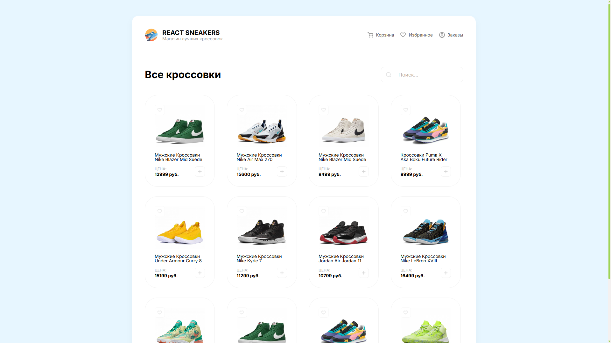
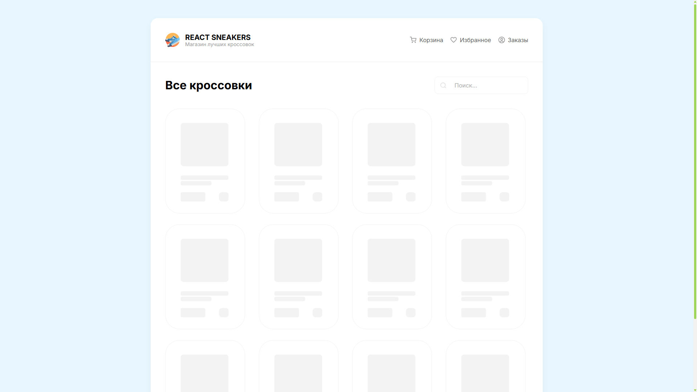
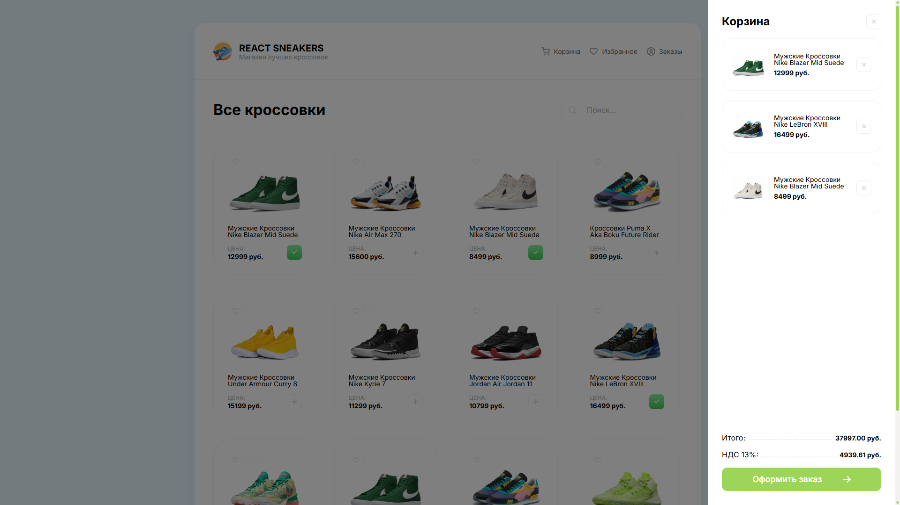
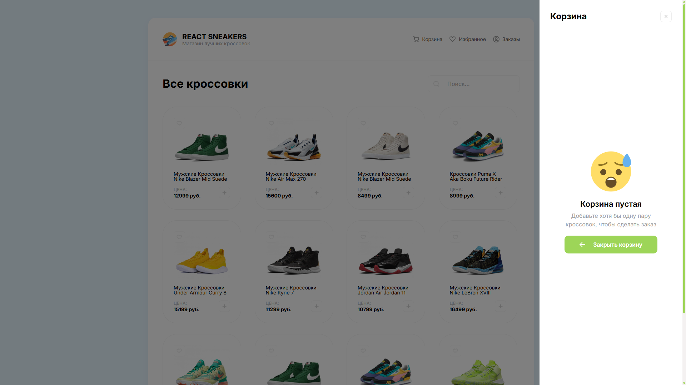
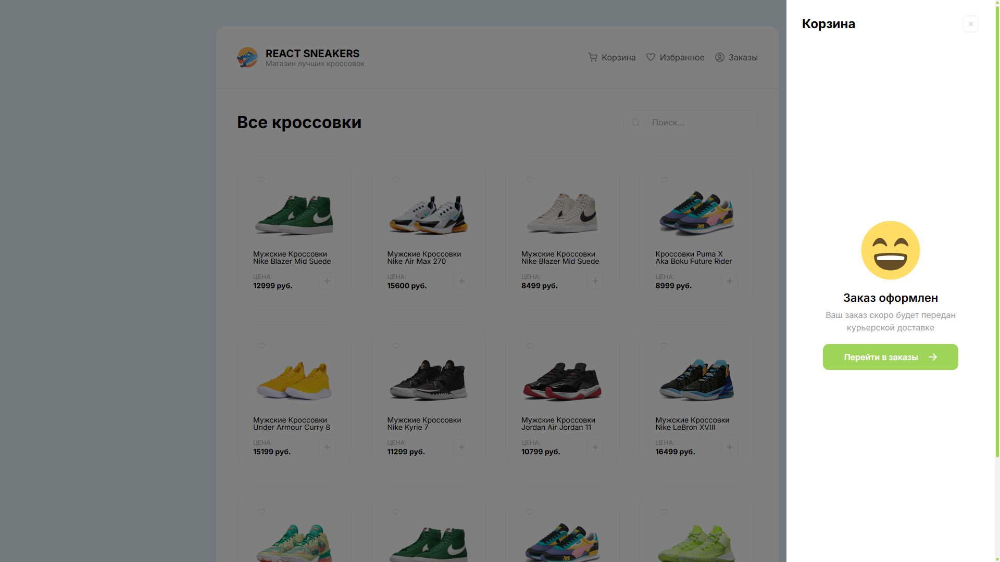
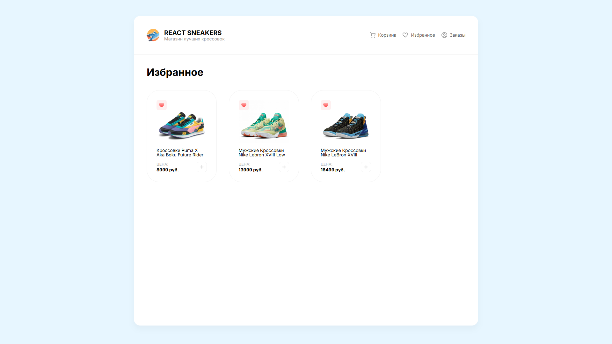
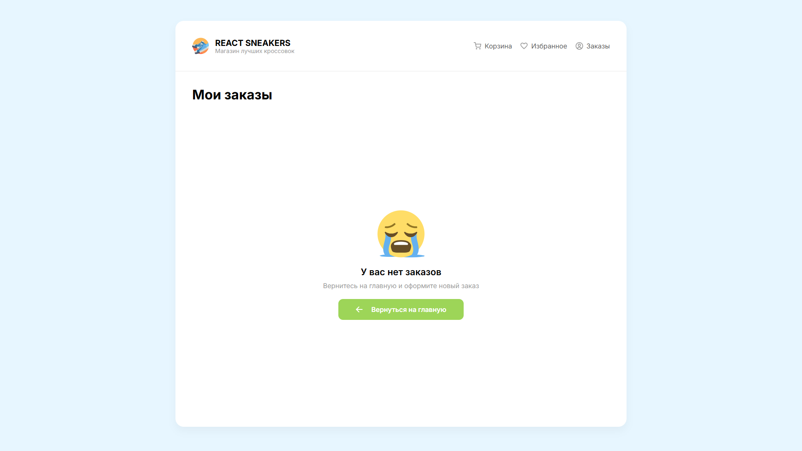
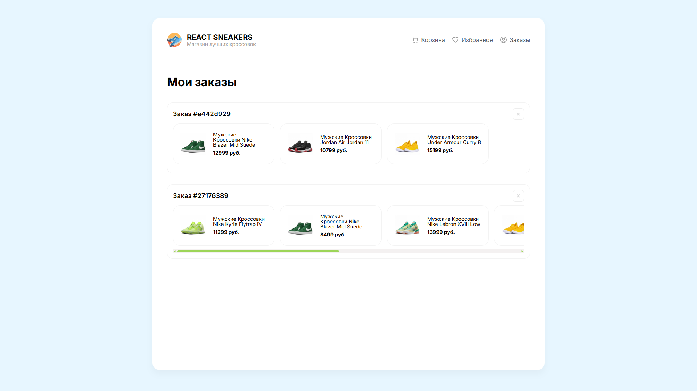

# Sneakers Frontend

Frontend for the **Sneakers** educational project.

> React-based interface for sneaker catalog, shopping cart, and user favorites.

---

## 🌐 Try it live

[](https://alexey-alanreys.github.io/sneakers-frontend/)

> Click the button above to open the live demo of the Sneakers project.

---

## 🧰 Tech Stack

> A quick overview of the main tools and libraries used in this project.

**Core:**

- **React 19** — JavaScript library for building user interfaces
- **Vite** — fast build tool and development server
- **React Router DOM** — client-side routing

**UI Components & Styling:**

- **React Content Loader** — skeleton loading components
- **CSS** — native CSS for styling

**Development Tools:**

- **ESLint** — JavaScript linting
- **Prettier** + **@trivago/prettier-plugin-sort-imports** — code formatting
- **Stylelint** — CSS linting and formatting

---

## 📸 Screenshots

This gallery shows the project interface.

#### Home catalog page



#### Loading state with skeletons



#### Shopping cart with items



#### Empty shopping cart



#### Order confirmation



#### Empty favorites


#### Favorites with sneakers



#### Empty orders page



#### Orders history



---

## ⚙️ Development

This project uses **Yarn** and requires **Node.js v22+**.

**API:**

This project uses [MockAPI.io](https://mockapi.io) for data management instead of a separate backend server. The API endpoint is hardcoded in the application and returns a collection of sneaker products.

To run the development server:

```bash
yarn install
yarn dev
```

---

## 🚀 Deployment

The project is automatically deployed to **GitHub Pages** via **GitHub Actions**.
Workflow file: `.github/workflows/deploy.yml`.

You can view the live site here:
👉 [https://alexey-alanreys.github.io/sneakers-frontend/](https://alexey-alanreys.github.io/sneakers-frontend/)

---

**License:** MIT
**Author:** [Alexey Alan-Reys](https://github.com/alexey-alanreys)
